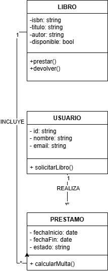
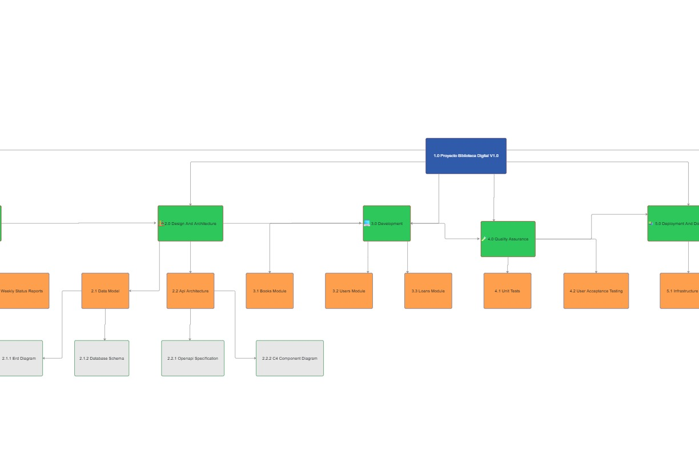

# 📚 Sistema de Gestión Bibliotecaria

## Descripción
Documentación técnica para el sistema de préstamos y catálogo de libros.

## Arquitectura
### Diagrama de Clases

## API Documentation
[Especificación Swagger (OpenAPI)](documentos/api/swagger.yaml)

## Guías
[Guía de Instalación](documentos/manual/INSTALACION.md)

## 🌳 Estructura de Desglose del Trabajo (EDT)

