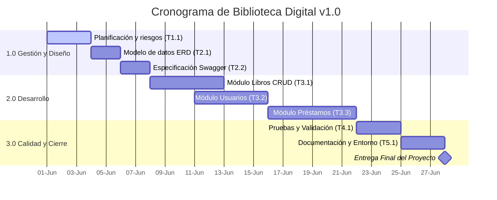

## 🗓️ Planificación de Tareas (4 Semanas)

### Fase 1: Inicio y Diseño (Semana 1: 2026-06-01 a 2026-06-07)
* **T1.1:** Crear cronograma y riesgos (01 al 03 junio)
* **T2.1:** Diseñar modelo de datos ERD (04 al 05 junio)
* **T2.2:** Especificar API en Swagger (06 al 07 junio) -> *Depende de T2.1*

### Fase 2: Desarrollo Central (Semanas 2 y 3: 2026-06-08 a 2026-06-21)
* **T3.1:** Desarrollo Módulo Libros (08 al 12 junio) -> *Depende de T2.2*
* **T3.2:** Desarrollo Módulo Usuarios (11 al 15 junio)
* **T3.3:** Desarrollo Módulo Préstamos (16 al 21 junio) -> *Depende de T3.1 y T3.2*

### Fase 3: Validación y Cierre (Semana 4: 2026-06-22 a 2026-06-28)
* **T4.1:** Pruebas técnicas y de usuarios (22 al 24 junio) -> *Depende de T3.3*
* **T5.1:** Configurar entorno y guías finales (25 al 27 junio)
* **M1:** Hito - Proyecto Listo para Entrega (28 junio)

## 📊 Diagrama de Gantt

## 🗓️ Planificación de Tareas (4 Semanas)

### Fase 1: Inicio y Diseño (Semana 1: 2026-06-01 a 2026-06-07)
* **T1.1:** Crear cronograma y riesgos (01 al 03 junio)
* **T2.1:** Diseñar modelo de datos ERD (04 al 05 junio)
* **T2.2:** Especificar API en Swagger (06 al 07 junio) -> *Depende de T2.1*

### Fase 2: Desarrollo Central (Semanas 2 y 3: 2026-06-08 a 2026-06-21)
* **T3.1:** Desarrollo Módulo Libros (08 al 12 junio) -> *Depende de T2.2*
* **T3.2:** Desarrollo Módulo Usuarios (11 al 15 junio)
* **T3.3:** Desarrollo Módulo Préstamos (16 al 21 junio) -> *Depende de T3.1 y T3.2*

### Fase 3: Validación y Cierre (Semana 4: 2026-06-22 a 2026-06-28)
* **T4.1:** Pruebas técnicas y de usuarios (22 al 24 junio) -> *Depende de T3.3*
* **T5.1:** Configurar entorno y guías finales (25 al 27 junio)
* **M1:** Hito - Proyecto Listo para Entrega (28 junio)

## 📊 Diagrama de Gantt

