# 📋 Lista de Actividades - Biblioteca Digital v1.0

| ID | Actividad | Owner | Esfuerzo (h) | Duración (días) | Dependencias |
|----|-----------|-------|-------------|-----------------|-------------|
| A1 | Diseñar modelo de datos (ERD) | @maria | 4h | 1 día | - |
| A2 | Crear esquema de base de datos | @maria | 2h | 0.5 días | A1 |
| A3 | Especificar API en swagger.yaml | @maria + @carlos | 6h | 1.5 días | A1 |
| A4 | Implementar GET /libros | @maria | 4h | 1 día | A2, A3 |
| A5 | Implementar POST /libros | @maria | 6h | 1.5 días | A4 |
| A6 | Implementar frontend listado de libros | @carlos | 5h | 1.5 días | A4 |
| A7 | Implementar formulario de préstamo | @carlos | 4h | 1 día | A5, A6 |
| A8 | Pruebas de integración | @ana | 3h | 1 día | A5, A7 |
| A9 | Pruebas con usuarios (UAT) | @ana + usuario | 2h | 1 día* | A8 |
| A10 | Despliegue en staging | @maria | 2h | 0.5 días | A9 |
| A11 | Documentación final y README | @carlos | 3h | 1 día | A10 |
| A12 | Cierre y lecciones aprendidas | @equipo | 2h | 0.5 días | A11 |

\*Nota: A9 incluye coordinación con usuario externo, por eso dura 1 día aunque el esfuerzo sea 2h.

💡 Regla práctica: Duración = Esfuerzo ÷ Capacidad diaria efectiva.
Ejemplo: 4h de esfuerzo con 6.5h productivas/día = ~0.6 días → redondear a 1 día laboral.

---

## 🔗 Dependencias - Biblioteca Digital v1.0

### Dependencias Finish-to-Start (FS) - Las más comunes

| Tarea | Depende de | Tipo | Justificación |
|-------|-----------|------|--------------|
| A2 | A1 | FS | No se puede crear el esquema sin el ERD aprobado |
| A3 | A1 | FS | La API se basa en el modelo de datos |
| A4 | A2, A3 | FS | El endpoint necesita BD + contrato API definidos |
| A5 | A4 | FS | POST requiere que GET ya funcione para validar |
| A6 | A4 | FS | El frontend consume el endpoint GET |
| A7 | A5, A6 | FS | El formulario necesita backend + frontend base |
| A8 | A5, A7 | FS | Las pruebas requieren funcionalidad completa |
| A9 | A8 | FS | UAT solo después de pruebas técnicas |
| A10 | A9 | FS | Despliegue después de validación con usuario |
| A11 | A10 | FS | Documentación final con producto estable |
| A12 | A11 | FS | Cierre después de entregar documentación |

---

## 📊 Diagrama de Gantt Técnico (Flujo A1-A12)

```mermaid
gantt
    title Plan de Desarrollo - Biblioteca Digital v1.0
    dateFormat  X
    axisFormat  Día %j
    
    section Diseño y Base de Datos
    Diseñar ERD (A1)           :a1, 0, 1d
    Crear Esquema BD (A2)      :a2, after a1, 0.5d
    Especificar Swagger (A3)   :a3, after a1, 1.5d

    section Desarrollo Core
    Implementar GET (A4)       :a4, after a2 a3, 1d
    Implementar POST (A5)      :a5, after a4, 1.5d
    Frontend Listado (A6)      :a6, after a4, 1.5d
    Formulario Préstamo (A7)   :a7, after a5 a6, 1d

    section Calidad y Cierre
    Pruebas Integración (A8)   :a8, after a5 a7, 1d
    Pruebas UAT (A9)           :a9, after a8, 1d
    Despliegue Staging (A10)   :a10, after a9, 0.5d
    Docs Finales (A11)         :a11, after a10, 1d
    Cierre Proyecto (A12)      :milestone, a12, after a11, 0d
```

