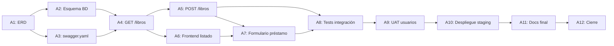

## 🕸️ Red de Dependencias (Mermaid)

```mermaid
graph LR
    A1[A1: ERD] --> A2[A2: Esquema BD]
    A1 --> A3[A3: swagger.yaml]
    A2 --> A4[A4: GET /libros]
    A3 --> A4
    A4 --> A5[A5: POST /libros]
    A4 --> A6[A6: Frontend listado]
    A5 --> A7[A7: Formulario préstamo]
    A6 --> A7
    A5 --> A8[A8: Tests integración]
    A7 --> A8
    A8 --> A9[A9: UAT usuarios]
    A9 --> A10[A10: Despliegue staging]
    A10 --> A11[A11: Docs final]
    A11 --> A12[A12: Cierre] 
```